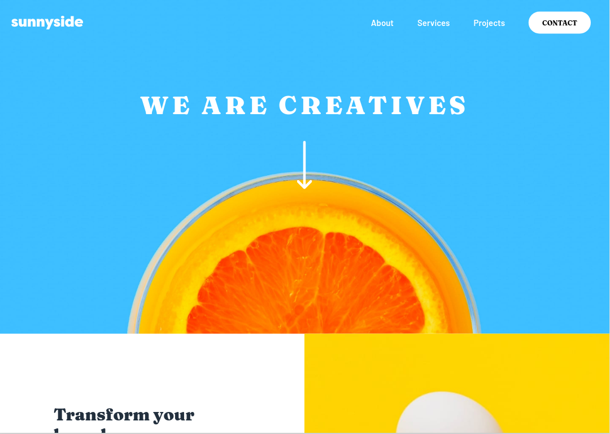

# Frontend Mentor - Sunnyside agency landing page solution

This is a solution to the [Sunnyside agency landing page challenge on Frontend Mentor](https://www.frontendmentor.io/challenges/sunnyside-agency-landing-page-7yVs3B6ef). Frontend Mentor challenges help you improve your coding skills by building realistic projects.

## Table of contents

## Table of contents

- [Overview](#overview)
  - [The challenge](#the-challenge)
  - [Screenshot](#screenshot)
  - [Links](#links)
- [My process](#my-process)
  - [Built with](#built-with)
- [Author](#author)

## Overview

### The challenge

Users should be able to:

- View the optimal layout for the site depending on their device's screen size
- See hover states for all interactive elements on the page

### Screenshot

### Links

- Solution URL: [https://github.com/atinybeardedman/sunnyside-landing-page](https://github.com/atinybeardedman/sunnyside-landing-page)
- Live Site URL: [https://youthful-nobel-eb0831.netlify.app](https://youthful-nobel-eb0831.netlify.app)

## My process

I approached this site with the intention of working on using scss as a preprocessor and using the BEM convention for styling. I first created the mobile styling, then went on to adapt to the desktop changes. 

I learned a good bit about scss in doing this, and enjoyed the development experience more than regular css. In some ways I found myself having a harder time with using the BEM conventions as it in some ways conflicts with one of the most useful features of scss (nesting styles). It seems that there are also a number of different BEM conventions and they conflict a bit in their ideas, so I had to pick one that I found to be the most clear.

One thing I try my best to do whenever possible is to not repeat DOM elements and hide them for desktop or mobile. I'm not sure if this is best practice, but I don't like the idea of doubling links in a mobile menu if I can find a way to style it instead. I think I was fairly successful in this regard, but I'm not sure if it's considered best practice.

### Built with

- Semantic HTML5 markup
- Flexbox
- Mobile-first workflow
- SCSS
- BEM

## Author

## Author

- Website - [Sean Dickinson](https://seandickinson.dev)
- Frontend Mentor - [@atinybeardedman](https://www.frontendmentor.io/profile/atinybeardedman)

## Acknowledgments

I need to give credit to Dave Alger's useful [codepen](https://codepen.io/run-time/pen/VNRBJd) that showed me an easy way to create the triangle for the mobile menu. It's a clever solution using transparent and filled borders on a ::before pseudo-element.